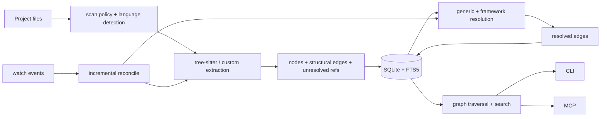

# CodeGraph architecture

This page describes the current Rust implementation. It covers ownership and
data flow; detailed CLI, MCP, storage, and golden contracts live in their owning
references.

## Workspace graph

The root `Cargo.toml` workspace list and each crate manifest are authoritative.
The following diagram shows normal (shipped) intra-workspace dependencies; test
and benchmark-only development dependencies are omitted.

```mermaid
graph TD
    core[codegraph-core]
    extract[codegraph-extract]
    store[codegraph-store]
    resolve[codegraph-resolve]
    graph[codegraph-graph]
    mcp[codegraph-mcp]
    watch[codegraph-watch]
    daemon[codegraph-daemon]
    ui[codegraph-ui]
    cli[codegraph-rs / codegraph binary]
    bench[codegraph-bench]

    extract --> core
    store --> core
    resolve --> core
    resolve --> extract
    resolve --> store
    graph --> core
    graph --> store
    mcp --> core
    mcp --> graph
    mcp --> resolve
    mcp --> store
    watch --> core
    watch --> extract
    watch --> resolve
    watch --> store
    daemon --> core
    daemon --> mcp
    daemon --> watch
    ui --> core
    ui --> extract
    ui --> store
    ui --> resolve
    ui --> graph
    ui --> mcp
    ui --> watch
    cli --> core
    cli --> extract
    cli --> store
    cli --> resolve
    cli --> graph
    cli --> mcp
    cli --> watch
    cli --> daemon
    cli --> ui
    bench --> core
    bench --> extract
```

| Crate               | Responsibility                                                        |
| ------------------- | --------------------------------------------------------------------- |
| `codegraph-core`    | shared types, node IDs, configuration, classification, logging        |
| `codegraph-extract` | source discovery, language/custom extraction, unresolved references   |
| `codegraph-store`   | SQLite/FTS5 schema, migrations, persistence, queries, leases          |
| `codegraph-resolve` | generic import/name matching and framework-aware resolution           |
| `codegraph-graph`   | traversal, impact, query parsing, search ranking                      |
| `codegraph-mcp`     | tool schemas/engine, rmcp stdio and streamable-HTTP transports        |
| `codegraph-watch`   | incremental reconciliation and filesystem watcher                     |
| `codegraph-daemon`  | detached shared process, IPC, and process registries                  |
| `codegraph-ui`      | browser viewer: loopback JSON API, live channel, embedded `ui/` build |
| `codegraph-rs`      | clap CLI, agent installer, orchestration, shipped binary              |
| `codegraph-bench`   | equivalence oracle and benchmark harness; not shipped                 |

The dependency direction keeps extraction independent of persistence and keeps
storage independent of query presentation. The CLI is the product assembly root.

## Indexing data flow



### Discovery and extraction

`codegraph-extract` applies project configuration, ignore rules, extension
overrides, generated-file signals, and deterministic path ordering before
parallel file parsing. A file then follows one of these paths:

1. a custom/embedded extractor (Vue, Svelte, Astro, Razor, Liquid, MyBatis XML,
   DFM/FMX);
2. a grammar-backed `LanguageSpec` and generic tree-sitter walker; or
3. file-level handling for formats that intentionally expose no language symbols.

The walker emits file/symbol nodes and structural ownership edges immediately.
Calls, imports, type relationships, decorators, and framework evidence that need
global knowledge are stored as unresolved references. Per-file extraction is
fail-closed: an unsafe tree depth or fatal parse condition cannot leave a partial
replacement graph for that file.

File parsing can run in parallel because each input is independent. Persistence
and later resolution restore stable order before output; scheduler completion
order is never a graph contract.

### Storage

`codegraph-store` owns a project-local SQLite database with FTS5. Fresh databases
start at the current schema; older supported databases advance through ordered,
transactional migrations. Foreign keys, WAL behavior, indexes, FTS triggers, and
lease/state gates are configured by the store rather than by callers.

See [`data-model.md`](data-model.md) for the current schema version, tables,
indexes, and migration history.

### Resolution

`ReferenceResolver` reads the complete extracted snapshot (or the bounded
streaming path for very large graphs), then applies deterministic strategies:

1. language-aware imports, re-exports, packages, and paths;
2. qualified, scoped, receiver/type, lexical, and exact-name matching;
3. detected `FrameworkResolver` implementations; and
4. bounded follow-up passes for relationships that require graph conformance.

The selected target then passes fail-closed correctness gates: language/module
visibility, C-family macro and translation-unit scope, Go local bindings,
external-import locality, and target-kind eligibility. Pure JS-family alias
bindings may forward to a unique callable; wrappers and ambiguity stop at the
binding. A framework-resolved edge carries its own reachability proof and is not
erased by ordinary source-language visibility (for example Tauri IPC to a
private Rust command).

The registered framework candidates are NestJS, React/Next.js, Vue/Nuxt, Godot,
and Tauri, in a deliberate order. Each activates only when its detection guard
matches. Godot also extracts project/scene/resource relationships; Tauri bridges
literal JS-family `invoke` calls to uniquely registered Rust commands. Ambiguous
or dynamic targets remain unresolved rather than falling through to a global
same-name guess.

The static/runtime boundaries for supported languages and Godot are documented in
[`languages.md`](../reference/languages.md), [`godot.md`](../reference/godot.md), and the upstream-difference
ledger in [`upstream-sync/KNOWN_DIFFS.md`](https://github.com/sunerpy/codegraph-rust/blob/main/docs/upstream-sync/KNOWN_DIFFS.md).

## Query layer

`codegraph-graph` operates on persisted nodes and edges. It owns callers,
callees, impact, paths, hierarchies, cycle detection, FTS candidates, fallback
matching, filters, and deterministic scoring. Generated/ambient/deprioritized
paths can affect ranking without removing graph facts.

The CLI and MCP share the same query engine for `search`, `explore`, and `node`,
so source selection, staleness handling, and relationship rendering do not drift
between interfaces.

## CLI assembly

The `codegraph-rs` package builds the `codegraph` binary. The CLI owns:

- lifecycle commands (`init`, `sync`, full index, status, recovery);
- query and analysis commands;
- MCP process launch and HTTP/stdio observability commands;
- agent/IDE configuration and Skill installation;
- shell completion and self-update; and
- human/JSON output contracts.

The CLI directly uses `codegraph-watch` for one-shot incremental synchronization
and `codegraph-daemon` for shared MCP service. It keeps logs on stderr so JSON and
MCP stdout remain protocol-clean. The complete command contract is
[`cli.md`](../reference/cli.md).

## MCP architecture

`codegraph-mcp` uses rmcp and Tokio for MCP protocol handling over stdio and
streamable HTTP. The source schema defines a known callable tool set and a smaller
default `tools/list` surface; an allowlist can expose any known tool. The current
source-derived counts are validated by `scripts/docs-check.py`, not maintained as
an unchecked architecture constant.

Each tool call resolves its project independently. A pinned server uses its
launch project; an unpinned server can use an explicit `projectPath`, client MCP
roots, or bounded deterministic workspace adoption. Engine caches are reopened
when the database is replaced and do not grant filesystem authority outside a
validated project.

Explicit project routing has a separate, bounded lifecycle layer. The first
access to an existing index goes through a session broker (maximum 32 projects),
which starts or attaches that project's shared daemon, retains a client
connection, and completes one catch-up before query execution. The daemon, not
the MCP handler, owns the watcher and long-lived writer lock. This keeps multiple
child indexes independent without choosing a default or creating state, while
several MCP sessions converge on one watcher owner per project.

Protocol revisions, default methods, tool schemas, project selection, staleness,
and HTTP headers are specified in [`mcp.md`](../reference/mcp.md).

## Daemon and watch lifecycle

`serve --mcp` chooses direct mode or the per-project shared daemon. A daemon owns
one project rendezvous, accepts multiple client sessions, starts the watcher, and
exits after its last client has been idle for the configured period. IPC uses Unix
local sockets or Windows named pipes. Project lock/state files stay under the
selected index root; long Unix socket paths may use a deterministic temporary
socket location recorded in the rendezvous metadata.

The watcher maintains per-directory watches outside ignored trees, debounces
bursts, reloads project control files, and reconciles additions, modifications,
deletions, and scope changes through `codegraph-watch`. Each mutation acquires the
store's short-lived `index.lock` writer authority; readers use corroborated state
and shared leases. A separate persistent `writer.pid` file carries an OS kernel
exclusive lock for the lifetime of the ONE process allowed to run watcher/catch-up
services for that project. Its JSON (`pid`, mode, start time) is diagnostic only;
the kernel lock is authority and is released automatically on process exit.

Default daemon mode multiplexes every MCP client onto that one writer. On a cold
start the foreground stdio session answers immediately without its own background
services while the detached daemon takes ownership. Explicit direct mode
(`CODEGRAPH_NO_DAEMON=1`) may own the writer instead; a second direct process fails
fast rather than alternating sync mutations. An unindexed explicit path remains
state-free: only `codegraph init` creates an index namespace.

Streamable HTTP is different: a server is keyed by bind address and can be pinned
to one project or globally accept explicit per-call projects. Detached HTTP and
foreground stdio processes use global observability registries. Those registries
do not replace project authorization or database leases.

Operational details and environment variables are in [`cli.md`](../reference/cli.md) and
[`mcp.md`](../reference/mcp.md).

## Determinism boundary

The durable compatibility boundary is the canonical graph, not SQLite file bytes
or process scheduling. Tests lock:

- node ID inputs and file-node IDs;
- canonical nodes, edges, unresolved references, files, and schema;
- incremental/full-index convergence;
- deterministic candidate and output ordering;
- structural MCP compatibility; and
- installer/release asset contracts.

See [`equivalence.md`](equivalence.md). Performance evidence is a separate
measurement discipline described in [`benchmark.md`](benchmark.md).
